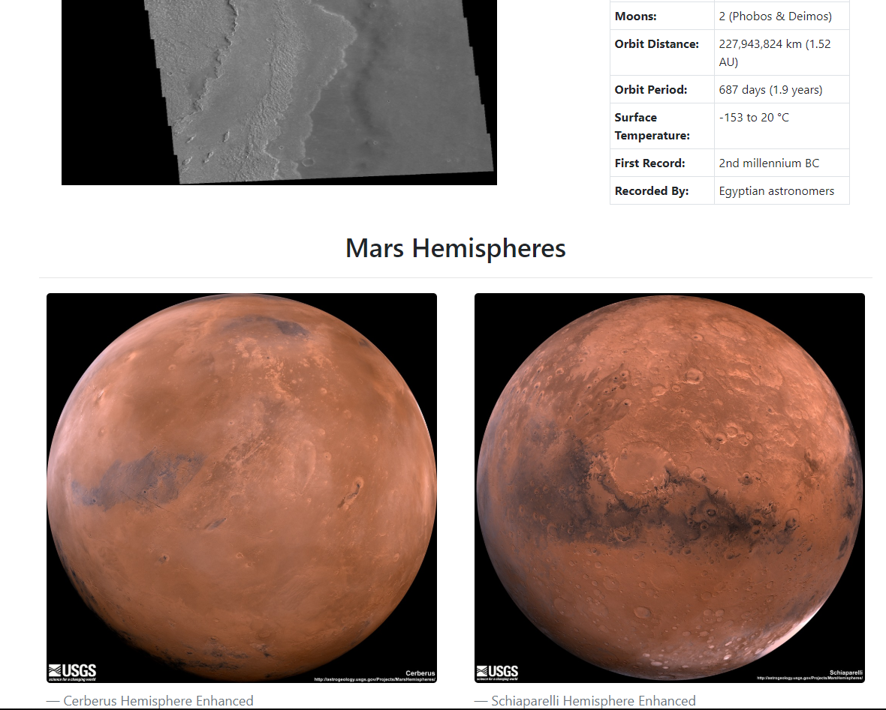

# mission-to-mars
Web application that scrapes various websites for data related to the Mission to Mars and displays the information in a single HTML page.

## Webpage:
* https://mars-journey.herokuapp.com/

## Technology Stack
Python 
Flask framework 
MongoDB 
Javascript 
HTML/CSS/Bootstrap 

## Data Sources:
* https://mars.nasa.gov/news/
* https://www.jpl.nasa.gov/spaceimages/?search=&category=Mars
* https://twitter.com/marswxreport?lang=en
* https://space-facts.com/mars/
* https://astrogeology.usgs.gov/search/results?q=hemisphere+enhanced&k1=target&v1=Mars

## License
[MIT](LICENSE) © Justin Le